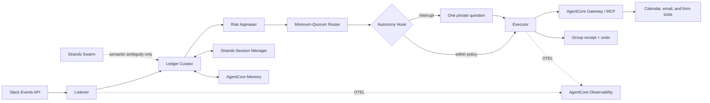

# Quorum

> A group coordination agent whose primary success metric is how rarely it interrupts people.

[](LICENSE)
[](https://agentsforhumans.devpost.com/)
[](https://agentsforhumans.devpost.com/)

Quorum coordinates the routine decisions that exhaust small communities. It listens where the group already talks, turns commitments into an evidence-linked ledger, acts autonomously only within earned boundaries, and asks the minimum number of people required for a safe decision.

Its product promise is deliberately unusual: **the best coordination agent is the one you barely notice.**

## Status

Quorum is an active entry in the 2026 AWS Agents for Humans Hackathon. This repository currently contains the verified competition contract, privacy tooling, evaluation plan, and implementation interfaces. The Slack and AWS production paths are not yet claimed as deployed.

No real organization data, user quote, impact result, live-demo URL, or evaluation score is claimed at this stage. Any sample data added before a real organization is recruited will be labeled `synthetic` in both its filename and metadata.

## The four mechanisms

1. **Commitment Ledger** — every extracted commitment keeps a source-message reference. If Quorum cannot point to evidence, it does not write the commitment.
2. **Autonomy Ladder** — low-risk actions graduate from ask-first to notify-and-undo only after repeated approvals. Rejection or reversal lowers autonomy.
3. **Minimum-Quorum Routing** — decisions go only to the smallest sufficient set of accountable people, with a visible timeout and default.
4. **Interrupt Budget** — each person receives at most two decision requests per rolling week by default. This is Quorum's primary product metric, not a settings toggle.

## One surface, three interactions

Quorum does not ask a community to adopt another application. Its complete interaction model is:

- one line in the group after an action, including an undo link;
- one direct message when a real decision cannot be made safely;
- one weekly summary showing outcomes and interruption spend.

## Planned architecture



The deterministic main path is a Strands Graph:

```text
Listener -> Ledger Curator -> Risk Appraiser -> Quorum Router -> Executor
```

Strands Swarm is intentionally excluded from routine orchestration. It is reserved for bounded semantic ambiguity resolution. Strands hook interrupts implement the autonomy gate before consequential tool calls.

Runtime session identifiers, session-state persistence, and long-term memory are separate concerns:

- AgentCore Runtime identifies a runtime session.
- A Strands session manager persists graph and conversation state.
- AgentCore Memory stores durable organization facts and summaries.

See [API.md](API.md) and [Method.md](Method.md) for the versioned contracts.

## Evaluation as a product feature

The project will include a 50-case, human-labeled commitment-extraction set. Every case will carry provenance and will measure:

- extraction precision;
- miss rate;
- hallucination rate, where an output without source evidence is always a failure.

Impact evidence will compare the same week under two conditions and report message count, closed decisions, decision-latency P50, total interruptions, and undo rate. Until real consented data exists, the replay demo will use visibly labeled synthetic data and no impact claim will be presented as real-world evidence.

## Privacy and safety

- Raw chat exports are processed locally and are ignored by Git.
- PII is redacted before data enters model, storage, logs, or evaluation artifacts.
- Logs contain opaque identifiers, counters, and trace IDs, never raw message text.
- Every ledger row requires a source-message reference.
- Money, broad-impact, or hard-to-reverse actions require an interrupt or sufficient quorum.
- Real quotations require explicit publication approval.
- Synthetic and real datasets remain physically and semantically separated.

The local redaction tool uses only the Python standard library:

```bash
export QUORUM_REDACTION_KEY='use-a-long-local-secret'
python3 tools/redact_chat.py \
  --input ./data/raw/export.json \
  --output ./data/redacted/export.json \
  --report ./data/redacted/report.json
python3 -m unittest discover -s tests -v
```

Do not reuse a published example key for real data. The key must never be committed.

## Known limits

- The real-time channel target is Slack. Discord is not in the initial build.
- We do not claim real-time WeChat or WhatsApp ingestion. A consented export may be replayed offline after local redaction.
- The current project has no recruited pilot organization and therefore no real-week impact result yet.
- Calendar, email, and form actions will be enabled only after their real SDK or MCP contracts and undo behavior are tested.

## Reuse and AI assistance disclosure

This repository was created during the hackathon submission period. As of the initial repository version, it incorporates no pre-existing application code. Standard libraries, open-source dependencies, official examples, and templates will be listed with their licenses as they are introduced. AI coding assistance is used for implementation, review, testing, and documentation; the entrant remains responsible for every submitted artifact.

## Competition delivery checklist

- [x] Public repository target and Apache-2.0 license
- [x] English README and explicit current limitations
- [x] Privacy-first local redaction tool and test plan
- [ ] Working Strands Graph with source-evidence gate
- [ ] Hook interrupt autonomy gate
- [ ] AgentCore Runtime, Memory, Gateway, and OTEL traces
- [ ] Anonymous synthetic replay demo
- [ ] 50-case gold evaluation report
- [ ] Consented real-organization comparison and quotation
- [ ] Architecture diagram asset
- [ ] Public YouTube or Vimeo video no longer than five minutes
- [ ] Three public Builder Center posts with `Agents for Humans` in each title
- [ ] AWS Builder ID added to the Devpost submission

## License

Licensed under the [Apache License 2.0](LICENSE).
